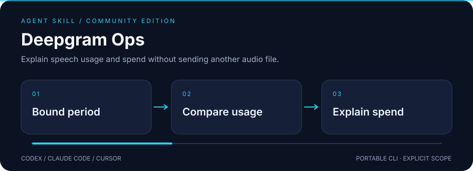

# Deepgram Ops

**Explain speech usage and spend without sending another audio file.**



A standalone skill for **Codex · Claude Code · Cursor**, backed by a portable Python CLI.
Independent community project; not affiliated with or endorsed by the provider.

## ✨ What it does

- Compare usage and billing by project, date and supported grouping dimensions.
- Require increasing date ranges of at most 31 days for usage, billing breakdown and request-list commands.
- Summarize hours, requests, tokens, characters and cost; inspect request metadata without performing inference or changing keys.

## 🚀 Install

Requires Node.js **22.20+** for the tested skills installer.

```sh
npx skills@1.7.1 add joeeeeey/deepgram-ops --agent codex claude-code cursor --yes
```

The implementation is initially delivered in a pull request. Until that PR is merged,
reviewers can install the branch with:

```sh
npx skills@1.7.1 add 'https://github.com/joeeeeey/deepgram-ops#feat/standalone-skill' --agent codex claude-code cursor --yes
```

Then ask your agent to use **deepgram-ops**. The standard SKILL.md and bundled CLI are the
portable interface; no dependency on another personal skill is needed.

## 🔎 Try it

From the installed skill directory, or a repository checkout:

```sh
python3 scripts/deepgram_ops.py projects list --summary
python3 scripts/deepgram_ops.py usage breakdown --project-id PROJECT_ID --start 2026-01-01 --end 2026-01-08 --summary
python3 scripts/deepgram_ops.py billing balances --project-id PROJECT_ID --summary
```

Python 3.10+. `DEEPGRAM_API_KEY` or explicit `DEEPGRAM_API_KEY_FILE`. Use a key with management scopes for the requested resource (project, usage or billing access). No legacy /tmp credential discovery; `doctor` checks local credential availability without a network call.

Run `python3 scripts/deepgram_ops.py --help` for all commands.
Use a secret manager or a private local file for credentials; avoid pasting values into shell history.

## How to use it well

Establish the project and bounded period before querying. Keep usage quantities and billed dollars separate; do not treat a current balance as period spend. Report returned records and pagination limits. If a total is missing, say unavailable rather than substituting zero. Avoid raw request detail unless necessary for the user's diagnosis.

## 🧪 Compatibility and verification

| Layer | Scope |
| --- | --- |
| Runtime | Python 3.10+; dependency-free standard library helpers |
| Agent interface | Standard SKILL.md + relative scripts; Codex, Claude Code, Cursor |
| Offline verification | Synthetic fixtures and mocks; run `python3 -m unittest discover -s tests -v` |
| Installation / native execution | See [validation evidence](references/validation.md) for exact tested levels |
| Live account operations | Not exercised as part of this release |

The illustration uses declarative SVG animation, with a readable static state and reduced-motion
fallback. It contains no JavaScript, external font or remote image dependencies.

## Limits and data handling

Read-only Management API; no transcription, audio download, key creation or purchase. Request lists and purchases return the requested page, and summaries cover that response. Generic get accepts provider parameters directly, so the agent must preserve bounded scope. Currency and billing semantics follow Deepgram.

Secret-like fields and configured credential values are redacted where supported. Ordinary
resource names, logs and account metadata may still be private: review output before sharing.

[Official documentation and API notes](references/api.md) · [MIT license](LICENSE)

## Provenance

Extracted and maintained from the author's existing local skill implementation, with
account-specific defaults and private operational notes removed. Documentation, fixtures and
SVG artwork in this distribution are original. External runtimes and provider services retain
their own licenses and terms; this repository does not redistribute them.
